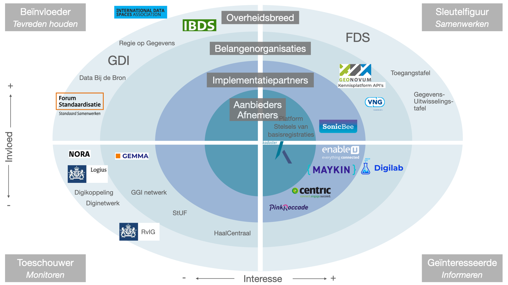

# Stakeholders
Op onderstaande kaart zijn de stakeholders uitgezet. 

### Leeswijzer
De horizontale as gaat over interesse. 
Aan de rechterkant geplaatste stakeholders hebben meer interesse in het onderwerp FTV dan de links geplaatste. 
Dat kan zijn omdat ze belang hebben bij de resultaten, maar ook dat ze het onderwerp een warm hart toedragen vanuit hun eigen doelstellingen.

De verticale as gaat over invloed. 
Boven het midden geplaatste stakeholders kunnen meer invloed uitoefenen op de resultaten. 
Dat kan zijn omdat ze advies geven, omdat ze concreet daan meewerken aan de producten, of bijvoorbeeld het onderwerp kunnen agenderen.

**Let op**
Hoe ver een stakeholder naar links/rechts of boven/beneden staat geeft niet per se weer hoeveel invloed en interesse er is. 
De plaatsing is eerder een gevolg van de praktische vormgeving.

