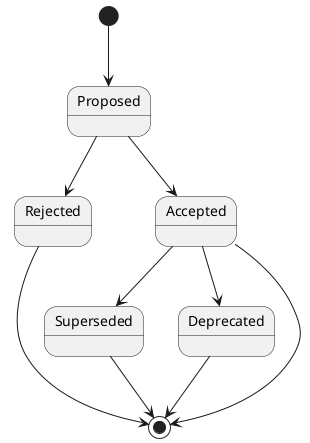

# ADR

Architecture Decision Records (ADR's) for the [Federatieve Toegangsverlening project](https://gitlab.com/digilab.overheid.nl/ecosystem/federatieve-toegangsverlening).

Background information regarding ADR's in general can be found on the [ADR Github organization](https://adr.github.io/)

The specific Architecture Decision Records are formatted using the format of `Michael Nygard` described [here](https://cognitect.com/blog/2011/11/15/documenting-architecture-decisions).
You can use [adr-tools](https://github.com/npryce/adr-tools) or [adr-go](https://github.com/marouni/adr/tree/master) for managing the ADR files.

The ADR's are stored in this repository in the `doc/arch` directory as Markdown files.

In each ADR file, write these sections:

## Title

### Status

What is the status, such as proposed, accepted, rejected, deprecated, superseded, etc.?

### Context

What is the issue that we're seeing that is motivating this decision or change?

### Decision

What is the change that we're proposing and/or doing?

### Consequences

What becomes easier or more difficult to do because of this change?

# Usage
Since ADR's are stored in plain text markdown files some guidelines according structure and content need to be provided.

## Statusses
ADR's in this repository *MUST* have one of these statusses:
- Proposed
- Accepted
- Rejected
- Deprecated
- Superseded


### ADR tools
ADR tools can be used to create new ADR's:
```shell
adr new the title of the ADR
```

The ADR tool can also be used to create a new ADR that supersedes an existing ADR:
```shell
adr new -s 1 this adr supersedes adr #1
```
