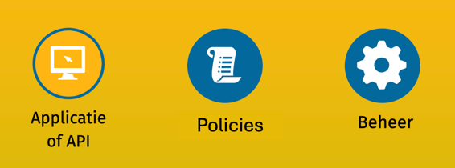
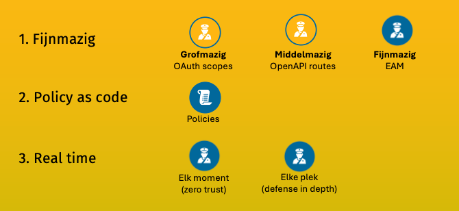
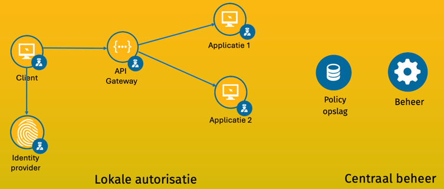
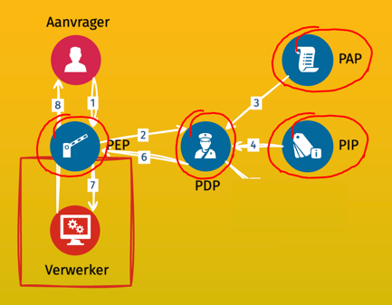
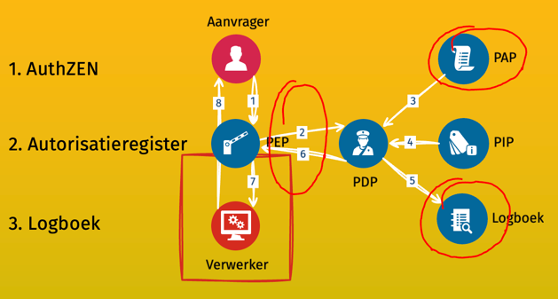


De kern van het project is de gekozen methodiek, oftewel de voorgestelde werkwijze. De methodiek beschrijft vanuit technisch en functioneel perspectief hoe een oplossing voor toegang eruit moet zien om de voordelen van Federatieve Toegangsverlening (FTV) te behalen.




### In deze sectie

   

      De EAM principes
   

   

      <a href="standaarden">De FTV-standaarden</a>
   

   

      <a href="federatief">Federatief EAM</a>
   




De term voor de gekozen methodiek is Externalized Authorization Management (soms ook wel Externalized Access Management).
In deze methodiek worden toegangsverzoeken, -beslissingen en -beleid op gestandaardiseerde wijze gemodelleerd
en buiten de applicaties gebracht zodat deze centraal beheerd kunnen worden.

**EAM in vogelvlucht**

Een overzicht van EAM in 2:30.

<video width="640" height="480" controls>
  <source src="methodiek-slidecast.mp4" type="video/mp4">
</video>

<a href="methodiek-slidecast-transcript.txt" download>Transcript downloaden</a>





De basisgedachte is het scheiden van verantwoordelijkheden (separation of concerns). Regels worden gescheiden van code in zogenaamde policies, en het beheer van policies wordt gescheiden van het handhaven ervan.





De drie belangrijkste kenmerken van EAM zijn:

1. **Fijnmazige** toegangscontrole. We onderscheiden drie niveaus van fijnheid: 

     - Grofmazige toegangscontrole vindt plaats tijdens login en gebruikt informatie over de gebruiker en de te gebruiken diensten om te bepalen welke toegang mogelijk is. Hier is OAuth met scopes het meest bekende mechanisme.
     - Middelmazige toegangscontrole filtert toegang tijdens het aanroepen van een API op basis van de gebruiker, gevraagde API en gevraagde verwerking. OpenAPI routes is daar een bekende standaard in.
     - Fijnmazige toegangscontrole maakt gebruik van nog meer kenmerken. Die komen behalve voorgenoemde bronnen ook uit de context, de omstandigheden van de aanroep. Daaronder rekenen we o.a. de datum/tijd, de beveiliging van de verbinding en het IP-adres van de aanroeper. En daarnaast kunnen allerlei situatiespecifieke attributen en berekeningen gebruikt worden. In de overheidscontext kan je denken aan doelbinding en grondslag.

3. **Policy as code**. De policies worden beheerd met dezelfde zorgvuldigheid als broncode. Er wordt versiebeheer gebruikt, zodat de historie bekend en teruggegaan kan worden naar vorige versies. Er is workflow zodat bijvoorbeeld schrijven, controleren en vrijgeven van policies aparte taken zijn. En er is toegangscontrole op de policies zelf.
3. **Real time**. Policies worden niet alleen tijdens login uitgevoerd, maar op elk moment wanneer toegang gevraagd wordt (zero trust) en op elke plek in de keten waar toegang gevraagd wordt (defense in depth).

EAM is een overkoepelend begrip waaronder bekende termen zoals Policy -, Attribute -, en Relationship Based Access Control (PBAC, ABAC en ReBAC) vallen.





In de fysieke architectuur zien we de scheiding van verantwoordelijkheden terug. In dit voorbeeld haalt een client een token op bij de Identity Provider en benadert via de API-Gateway twee applicaties.

Toegangscontrole vindt plaats op elke plek in het systeem. Op elke plek worden alleen die policies die daar gehandhaafd dienen te worden geëvalueerd.

De policies worden echter op een centrale plek beheerd. Daar worden ze geschreven, gecontroleerd en worden versies beheerd. Op het moment dat wijzigingen effectief moeten worden, wordt de juiste versie naar de juiste plek overgebracht.

In de [technische architectuursectie](architectuur) omschrijven we de gangbare componenten van de toegangsoplossing en plaatsen we deze in het wijdere IT-landschap.




Welke verantwoordelijkheden precies gescheiden moeten worden is al meer dan 20 jaar geleden bedacht als onderdeel van de XACML autorisatiestandaard. Deze standaard bevat nog veel meer, waaronder een XML-gebaseerde policy-taal. Hoewel XML goeddeels uit de gratie is gevallen, zijn de basisverantwoordelijkheden algemeen geaccepteerd in de zogenaamde PxP-architectuur.

De flow van informatie volgt de nummers, als volgt:

1. Het Policy Enforcement Point (**PEP**) onderschept een verwerkingsverzoek en handhaaft (enforced) daarmee de toegang op de verwerking 
2. Het PEP stuurt een verzoek aan het Policy Decision Point (**PDP**), een beslissing te nemen.
3. Het Policy Access Point (**PAP**) voorziet het PDP van de policies
4. Het Policy Information Point (**PIP**) haalt additionele informatie op wanneer dat nodig is voor het maken van de toegangsbeslissing.
5. Het PDP communiceert terug welke beslissing genomen is
6. Als de beslissing positief is gaat het verzoek door naar de verwerking
7. Het antwoord, zijnde hetzij de gewenste verwerking, hetzij een afwijzing, gaat terug naar de aanvrager.




De principes van EAM en de PxP architectuur geven goede richtlijnen voor implementatie. Om het doelen van uitwisselbaarheid te behalen is echter meer detail nodig. En daarnaast wordt het doel van traceerbaarheid niet geadresseerd door deze principes. In FTV werken we daarom aan een drietal standaarden:

1. **AuthZEN**. De wijze waarop de PEP het toegangsverzoek stelt en de wijze waarop de PDP het antwoord geeft. Kern daarvan is een informatiemodel. Er is gekozen voor de AuthZEN standaard als basis.
2. **Register toegangsbeleid**. Dit gaat over de eisen die gesteld worden aan het PAP zodat policies goed opgeslagen en opgehaald worden, inclusief versiebeheer.
3. **Logboek toegangsbeslissingen**. Een logboek waarin genomen toegangsbeslissingen worden bijgehouden.

[Deze standaarden](standaarden) zijn op de volgende pagina verder uitgewerkt.


