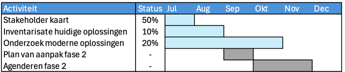

## Resultaten

De beoogde resultaten van fase 1 zijn, zoals vastgelegd in de subsidieaanvraag:
1.	[In kaart brengen van de stakeholders](2.1stakeholders.md) 
2.	[Inventarisatie van de huidig (meest voorkomende) ge&iuml;mplementeerde oplossingen](2.2huidige_oplossingen.md))
3.	[Onderzoek mogelijke moderne oplossingen passend bij API’s](2.3.0moderne_oplossingsrichtingen.md)
4.	Plan van Aanpak fase 2
5.	Agendering van een besluit voor in gang zetten Fase 2 op programmeringstafel Gegevensuitwisseling / Toegang

## Activiteiten 

### Recent afgerond
- start project met PO (17 juni)
- start ontwikkelaar (1 juli)
- eerste versie stakeholder kaart (3 juli)
- project publiek zichtbaar op Gitlab (12 juli)
- Scope en context in kaart brengen (19 juli)

### Huidige activiteiten
- Contact maken met platforms en projecten in de context
- **Inventariseren (in overheidscontext)** van 
  - toegangsverleningsoplossingen zoals nu in productie gebruikt worden
  - bestaande onderzoeken naar:
    - vastleggen van wetten en beleidsregels (policies) zodat ze mens- en machineleesbaar zijn
    - gebruik van policy based access control (PBAC)
  - Standaarden en gebruik van semantiek (Linked Data) in datastelsels
- **Inventariseren (in de markt)** van
  - standaarden voor policies
  - systemen en platforms voor PBAC
- **Inventariseren (in de markt)** van
  - andere vertrouwensraamwerken

## Planning en status

